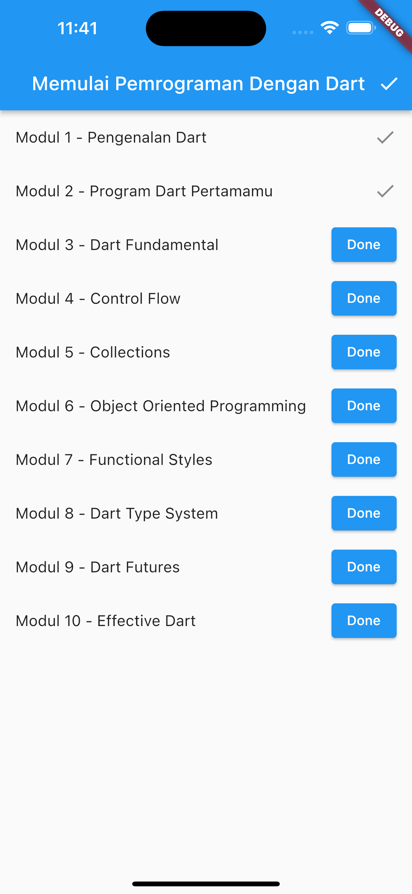
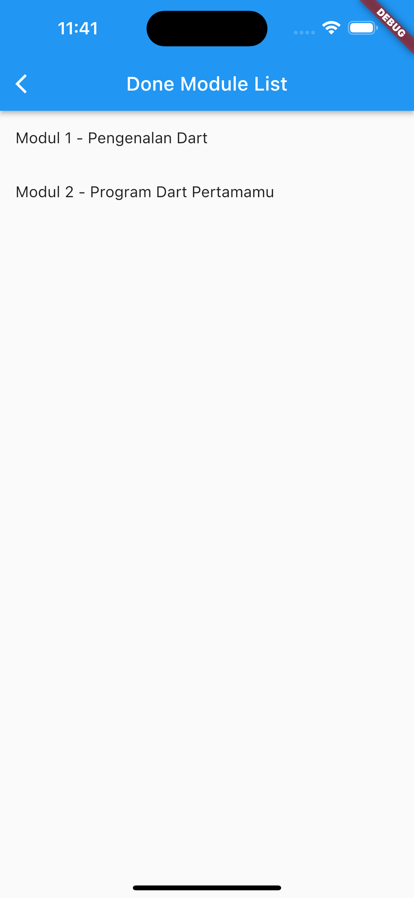

## Description

Projek ini merupakan latihan membuat aplikasi To Do List dengan menerapkan pendekatan state management [Provider](https://pub.dev/packages/provider) yang dibuat oleh developer dari komunitas. Provider merupakan salah satu pendekatan yang direkomendasikan oleh tim Flutter karena kode yang ringkas dan mudah digunakan.

## Development Setup

Clone the repository and run the following commands:

```
flutter pub get
flutter run
```

## Source

Dicoding Academy

## Screenshot

 &nbsp; 
